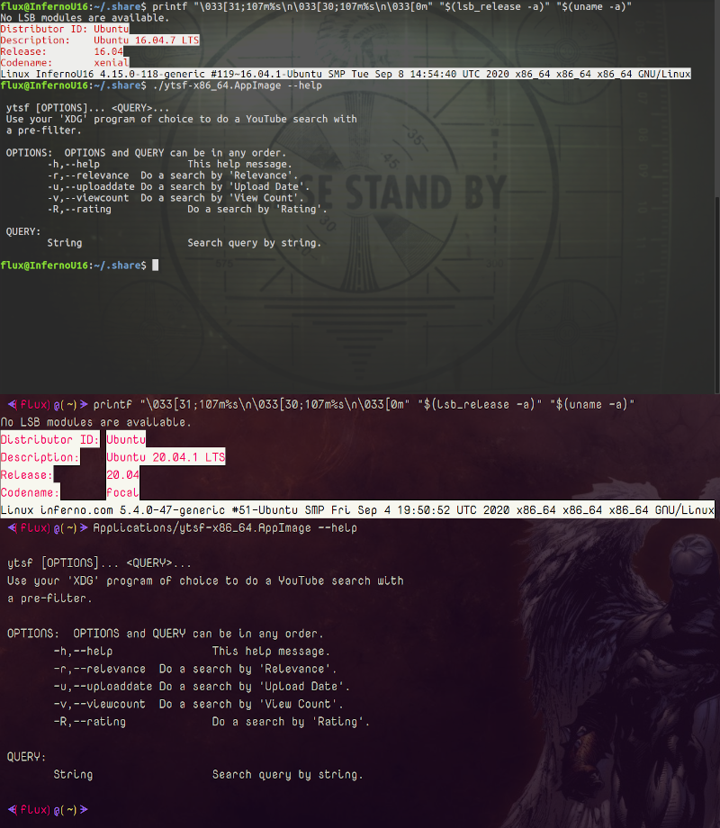

# YouTube Search Filter

|`Build`|`Status`|
|---:|:---|
![What Kind](https://img.shields.io/static/v1?logo=data:image/png;base64,iVBORw0KGgoAAAANSUhEUgAAAA4AAAAOCAMAAAAolt3jAAAABGdBTUEAALGPC/xhBQAAACBjSFJNAAB6JgAAgIQAAPoAAACA6AAAdTAAAOpgAAA6mAAAF3CculE8AAAB11BMVEUAAAA9U2GDnayLpraOqLeQqbiRqriPqLaPqLaRqriDnaw9U2Fid4SKp7iKp7hid4RfdYGHpbdYbnuCorRSaHV9nrFMYm93ma1HXGlwlKlwlKlBV2NojqQ7UV1hiKA2S1hYgpswRlJQfJcwRlIkMjlDbIVMfJpNfptOfptNfZpRfplTf5lMfJlOfptNfptDbIUkMjkHAAAuR1YzUWMzUWMzUmM0UmQzUWMyUWM0UmQzUmMzUWMzUWMuR1YHAACNsMWRs8aXt8mbuMm3ydSbuMmRs8aIrsONscWStMeZtsfk6u3k6u2ZtseStMeIrsOGrMKKr8SMr8Oswc3u8PHu8PGswc6Mr8OCqcCFrMKJrsOTssTT3OLS3OKTssSJrsOCqcB9pr5/p7+CqcCApryYs8Sdt8aApryCqb9/p799pr52obp4o7x9o7qswc7F09vO2eCwxNCCp7x4ort2obpvnLdxnbd9orjK1t3T3OLK1t7Y4OSFp7twnLZvnbdomLRolrKTsMHb4eWju8mRrsDd4+aiushplrJomLRhkrBik7Bmkq25ydLY3uLW3eHI09ptl69hkrBhkrBZjq1bj65ej613nbSRrr+etsV3nbRika1bjq5Zjq3///97NWaUAAAAP3RSTlMAAlOMioqKioqKUwIMwcEMDsQOxA7EDsQOxMQOxA7EDsQOxA4Lq/Lv7+/v7+/v76sLASI+Pj4+Pj4+Pj4+IgH2SccMAAAAAWJLR0SccbzCJwAAAAd0SU1FB+QIGBYnM5liyzQAAADPSURBVAjXY2BABYxMzCysbOwcnKwszFzcDDy89g6OTs7OLo6u9nz8DAKCbu4enl7ePr7ufoICDELC/gGBQcEhoWEB/sJCDCKi4RGRUdExsXER8aIiDGLiCYlJySmpaekZmeJiDBKSWdk5uXn5BYVFxVISDNIyJaVl5RWVVdU1tTLSDLJydfUNjU3NLa1t7XKyDPIKHZ1d3T29ff0TJirIMygqTZo8Zeq06TNmzpqtpMygoqqmrqGppa2jq6emb8BgaGRsYmpmbmFpZW1jawcAIDgy9UQeYeoAAAAldEVYdGRhdGU6Y3JlYXRlADIwMjAtMDgtMjRUMjI6Mzk6NTEtMDQ6MDBWWeqAAAAAJXRFWHRkYXRlOm1vZGlmeQAyMDIwLTA4LTI0VDIyOjM5OjUxLTA0OjAwJwRSPAAAAABJRU5ErkJggg==&label=AppImage&message=Status&color=b91d47&style=for-the-badge)|

  

## Coming Soon

Since this seems to be gaining a bit in popularity I'll be re-writing this in `C++` possibly cross-platform and then in the near future I plan a re-write in `RustLang` if there are portability issues or if I get around to it.

## Description

Do YouTube searches with (or without) a pre-filter from the Linux Bash command line since we can't do them at YouTube ourselves.

## Index
- [YouTube Search Filter](#youtube-search-filter)
	- [Coming Soon](#coming-soon)
	- [Description](#description)
	- [Index](#index)
	- [Usage](#usage)
	- [Installation](#installation)
	- [File Links](#file-links)
	- [Project Links](#project-links)
	- [Screenshots](#screenshots)
		- [Help Message](#help-message)
	- [License](#license)

## Usage

> Use the script and AppImage in the exact same way.

```Bash

 $ ytsf --help

 ytsf [OPTIONS]... <QUERY>...
 Use your 'XDG' program of choice to do a YouTube search with
 a pre-filter.

 OPTIONS:  OPTIONS and QUERY can be in any order.
	-h,--help		This help message.
	-r,--relevance	Do a search by 'Relevance'.
	-u,--uploaddate	Do a search by 'Upload Date'.
	-v,--viewcount	Do a search by 'View Count'.
	-R,--rating		Do a search by 'Rating'.

 QUERY:
	String			Search query by string.

```

## Installation

> Install the script and AppImage in the exact same way.

1. Download the script file: [[ytsf.bash](src/ytsf.bash)] or [[ytsf](src/ytsf)] or get it from the official release page:
- [Release Page](https://github.com/Lateralus138/YouTubeSearchFilter/releases/tag/Continuous) 
2. How to use:
   1. Place the script anywhere in your $PATH directories and/or...
   2. Execute/Run or Source the file:
      1. Run like any other script/file:
		```Bash
		$ /path/to/ytsf --help
		$ # or in directory:
		$ ./ytsf -u "Search query"
		$ # or if in $PATH
		$ ytsf "Search query" 
		```
      2. Or source the file with Completion:
		```Bash
		$ . /path/to/ytsf
		$ # or
		$ source /path/to/ytsf
		$ # or if in $PATH or directory:
		$ . ytsf 
		```
3. Change the file permissions to be executable:

```Bash
chmod u+x /path/to/script/file # for you only
# or
chmod +x /path/to/script/file # for any user
```

4. If you only use the function you can copy &amp; paste the following line (also found in the script) without the  comment '#' to any of your script/config/.dotfiles to enable Bash Completion:

```Bash
complete -W "-r --relevance -u --uploaddate -v --viewcount -R --rating" ytsf
```

If this script is sourced Bash completion will already be activated.

## File Links

|File|Description|
|:---:|:---:|
|[Bash Script (no extenstion)](src/ytsf)|Script File|
|[Bash Script (.bash)](src/ytsf.bash)|Script File|
|[AppImage](https://github.com/Lateralus138/YouTubeSearchFilter/releases/download/Continuous/ytsf-x86_64.AppImage)|Compiled AppImage.|

## Project Links

|Link|Description|
|:--:|:--:|
|[Official Project Page](https://lateralus138.github.io/YouTubeSearchFilter/)|The themed version of this page.|
|[Project Page](https://github.com/Lateralus138/YouTubeSearchFilter/)|This repository page.|
|[Current Releases](https://github.com/Lateralus138/YouTubeSearchFilter/releases/download/Continuous/)|The release files in "Continuous Build".|

## Screenshots

### Help Message



## [License](./LICENSE)


>This program is free software: you can redistribute it and/or modify it under the terms of the GNU General Public License as published by the Free Software Foundation, either version 3 of the License, or (at your option) any later version.

>This program is distributed in the hope that it will be useful, but WITHOUT ANY WARRANTY; without even the implied warranty of MERCHANTABILITY or FITNESS FOR A PARTICULAR PURPOSE.  See the GNU General Public License for more details.